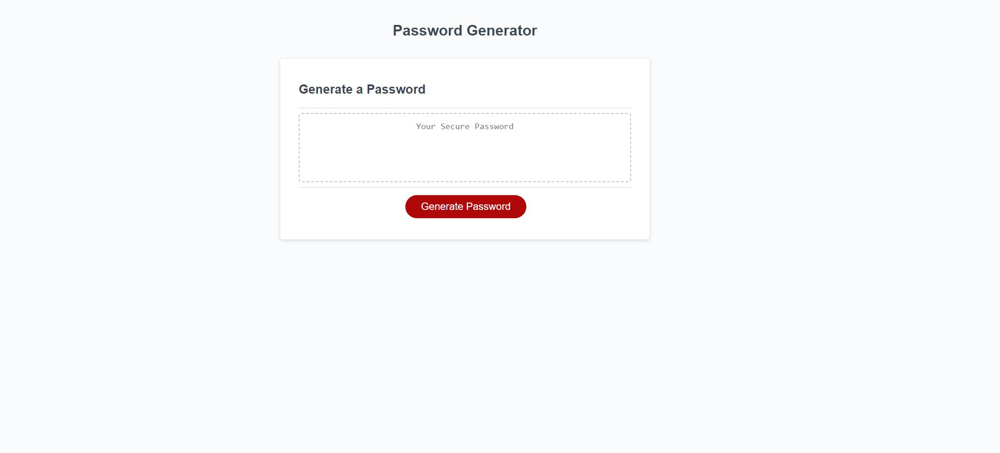

# Module-3-Challenge - Password Generator

## Project Description

The Module 3 Challenge objective was to create an application that an employee can use to generate a random password based on criteria they've selected. This app will run in the browser, and will feature dynamically updated HTML and CSS powered by JavaScript code that you write. It will have a clean and polished user interface that is responsive, ensuring that it adapts to multiple screen sizes.

## Deployment Screenshot

[Deployment Link](https://travisfowlston.github.io/Module-3-Challenge-Password-Generator/)

## Comments

- Created a series of prompts for the password criteria which ask whether to include lowercase, UPPERCASE, numbers, and special characters.
- Created a prompt to ask how many characters to include between the numbers 8 and 128.
- Created stipulations that state you must select at least one character type.
- Creates a password that is written to the page and is displayed in the container.

## Credits

- Starter code was provided by the UC Davis Bootcamp.
- JavaScript was completed by Travis Fowlston.

## License

N/A
